# 一种基于混沌映射和图像块的灰度图像加密方法

作者：
- Ashish Girdhar
- Himani Kapur
- Vijay Kumar

## 摘要
图像加密是将一个有意义的图像转换为一些像素强度的随机排列。也就是说，一张图片的可理解性被破坏掉。考虑到基于多种混沌系统的图像加密算法庞大的时间和空间复杂度，本文提出了一种采用三种混沌序列来实现较高层次加密的图像加密方法。该方法的新颖之处在于所设计的算法能够同时实现图像加密的置换和替换过程。在最后，通过对协同相关值的比较，评估了该算法与最近提出的许多图像加密方案的性能。

## 1 介绍
图片能够比文字更好的传达信息。图像的内容很容易被世界任何角落的任何人理解。但是，要使用文本来传达一些信息，需要两个先决条件。首先，接收者必须是一个有读写能力的的人（图像也可以被文盲理解）；第二，发送方和接收方必须掌握至少一种共同语言。因此，图像通常比文本更好。然而，信息技术的进步让地球上的每个人都登上了互联网。这就是为什么在通信中使用的图像更容易受到攻击。其中一种可行的解决方案是密码学。密码学将一个有意义的图像转换为一些随机的像素强度集合（叫做加密图像），让它看起来像一些随机的噪音。加密的图像可以用正确的密钥解密成原始图像。加密的图像没有向入侵者透露任何信息。为了增加一层安全性，加密的图像被添加到外观朴素的2D或3D图像中[25]。普通图像的加密可以在光学和数学领域进行。光学加密方法采用分数阶傅里叶变换[26,27]，双随机相位编码[28]，波长多路复用[29]和其他复用方法[30,31]。然而，正如在[28]中所指出的，光学方法的一些固有弱点阻碍了它们在图像加密中的应用。所提出的图像加密采用数字方法对图像进行加密，并基于两种混沌映射——Ikeda映射和逻辑映射。

据最近的一项关于图像加密的调查报道[1]，仅在2018年，大约有1000多篇与图像加密领域有关的出版物。所以，图像加密领域已经激起了研究人员的兴趣，并将继续下去。虽然加密的图像可以直接通过通信通道发送，但它也可以以不可见的方式隐藏在封面媒体中[2]。正如图1中展示的[3]中指出的那样，一个典型的图像加密模型包括两个阶段——置换和替代。本文提出了一种利用两种混沌映射的图像加密算法——Ikeda映射和逻辑混沌映射。混淆或替换在像素级进行，而混淆在像素级进行，而混淆或排列在位级进行。

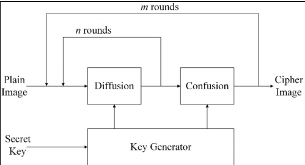
> 图1 一个典型的图像加密过程的骨架。

本文的结构如下。第二章节讨论了混沌映射及其优点。第三章节简要介绍了相关的图像加密方法。第四章节详细提出了提出的算法。第五章节详细的介绍通过仿真得到的算法与最先进方法的比较。接着，在第六章节阐述了结论。

## 2 混沌映射
混沌映射表现出各种有利的特性，使其适合用于图像加密过程。这些特征是——伪随机性，对初始条件（或控制参数）下的任何变化都极度敏感 和遍历性，本文使用了两个混沌映射。

### 2.1 Ikeda 映射
最初的混沌地图是由 Kensuke Ikeda 在实验中提出的[4]。复杂的 Ikeda地图 在二维空间中被划分如下：
$$
x_{n+1} = 1 + \mu(x_ncost_n - y_nsint_n) \\
y_{n+1} = \mu(x_nsint_n - y_ncost_n) \\
t_n = 0.4 - \frac{6}{1 + {x_n}^2 + {y_n}^2}
$$

其中，μ为控制参数。当μ>=0.6时，二维Ikeda映射表现出混沌行为。为了得到Ikeda映射的xy混沌吸引子，选择μ=0.9。取20个起点，追踪其运动轨迹，如图2所示。
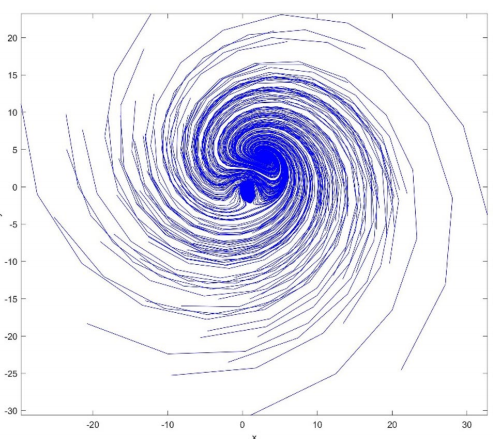
> 图2 Ikeda 映射的混沌吸引子。

在这个图中，可以观察到x∈（−40,35）和y∈（−30,30）。利用Ikeda图进行图像加密的融合过程，将这些混沌序列取到（0,1）范围。

### 2.2 逻辑混沌映射
逻辑混沌映射是几种图像加密算法中最常用的混沌映射。在数学上，一维逻辑混沌映射划分如下：
$$
x_{n+1} = \mu(1 - x_n)
$$

其中μ为控制参数。在μ>3.569945时，系统进入混沌状态[5]，在Matlab中实现一维逻辑图得到的分岔图如图3所示。可以观察到，对于μ的特定范围，地图上显示出混沌。
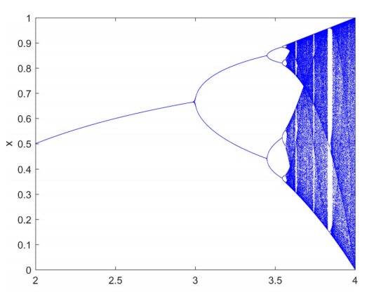
> 图3 在Matlab中得到的逻辑图的分岔图

由一维逻辑图得到的混沌序列被用于所提出的图像加密算法的混乱或排列的过程。下一节将简要回顾上述两种用于图像加密的混沌映射。

## 3 相关工作

虽然逻辑混沌映射被用于到目前为止的文献中提出的各种各样的图像加密技术；利用Ikeda映射用于建立图像加密混沌序列却仅限于极少数的图像加密算法[6]。
由于目前的工作是利用Ikeda映射对灰度图像进行图像加密，本文介绍了利用Ikeda映射进行灰度图像加密方案的文献综述。

Jia[7] 仅使用了 Ikeda 映射进行了相位像素映射和像素替换仿真结果表明，该算法对直方图分析、相关分析和关键敏感性分析具有良好的鲁棒性。Zhu 等人.[8]提出了一种比像素级排列更好的位级排列。在他们的方法中，Arnold 猫映射已被用于排列和混淆，逻辑图已被使用。Mannai 等人.[9]提出了Ikeda系统的离散版本。由离散的Ikeda 映射得到的混沌序列和通过纯图像像素获得加密图像进行异或。Alshibani 等人.[10]使用三种Arnold变换、Henon映射和Ikeda映射的混合方法来进行灰度图像的模糊阶段。本文对平像像素和掩蔽密钥进行了DNA编码。本文对平像像素和掩蔽密钥进行了DNA编码。对平像DNA序列与掩蔽键DNA序列进行特殊异或操作。通过对二元图和池田图的混沌序列进行排序操作，获得了掩蔽密钥。Parvees 等人.[11]提出了利用Ikeda映射和逻辑映射进行加密的彩色图像加密算法。对于每个颜色通道，从池田地图和逻辑地图中生成单独的混沌序列。Şekertekin 等人.[12]使用Ikeda映射进行排列，使用Henon映射进行融合。Becheikh 等人.[13]使用一维Ikeda映射和t函数生成一个用于灰度图像加密的S-box。结果表明，该S-box具有双射性、位独立性准则(BIC)、非线性、严格雪崩准则(SAC)、微分概率和线性逼近概率等基本性质。Hikal 等人.[14]提出了针对手掌打印图像的加密方案。因为手掌打印图像携带了个人的手掌线、形状和纹理的独特信息；这些都是最可靠的生物识别认证器。此外，解密过程应该能够返回完全相同的普通图像，因为甚至丢失一个像素可能会导致手掌打印匹配机制失败。作者混合使用了三种混沌地图——Arnold的猫映射（为了混淆）和Ikeda映射和增强的洛伦兹映射，用于混淆（或排列）图像中的像素混淆。Li 等人.[15]从Ikeda映射中得到两个混沌序列，其中一个混沌序列用于混淆阶段，另一个混沌序列用于混淆阶段。在他们的方法中，作者提出了一种新的方法来加密预览区域图像。加密的图像和预览图像放置在加密图像中。首先，对加密的预视区域图像进行解密，然后进行加密的图像。这是有用的，因为它节省了只解密感兴趣的图像的时间，而不是所有加密的图像。Girdhar 等人[16]最近的一项研究对从洛伦兹和罗斯勒超混沌系统中获得的混沌序列和彩色图像像素应用了异或操作，得到了非常好的结果。

从这篇文献综述中，我们可以观察到一些事情：
- 对混沌序列和图像像素值进行异或操作，会得到加密的图像。
- Ikeda映射的使用增加了普通图像的随机性。
- 正如回顾中指出的那样，位级的修改优于像素级。

记住上述几点，下一节将提出一种图像加密算法。

## 4 图像加密算法

该方法的简要概述如图4所示。利用池田图的混沌序列对普通图像进行模糊，利用逻辑图的混沌序列进行混淆。
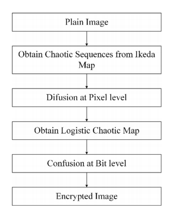
> 图4 图像加密算法简要过程

由于所提出的图像加密过程包括模糊和混淆两个阶段，因此将加密算法分为第一阶段模糊过程和混淆两个部分。

### 4.1 输注过程

1. 读取普通图片 ($I$) 的尺寸 ($M*N=R$)
2. 将 $I$ 分成两个每个大小为 ($M*(N/2)$) 的两部分——$I_1$ 和 $I_2$
3. 接下来，从大小为 $R/2$ 的Ikeda映射中获得混沌序列。
4. 为了保证混沌序列具有唯一的值，采用了[17]中的算法。这就产生了两个混沌序列—— $x$，$y$，它们是唯一的，其值在[$1$，$R/2$]中。
5. 将 $x$ 和 $y$ 重构为与 $I_1$ 和 $I_2$ 的维数相同的数组。
6. 对 $x$ 和 $y$ 个数组进行排序操作，并将索引排序保持在单独的数组中，如图5所示。需要记住的是，算法中将使用未排序的 $x$ 和 $y$ 数组，并进行排序操作以获得这两个数组的索引排序。

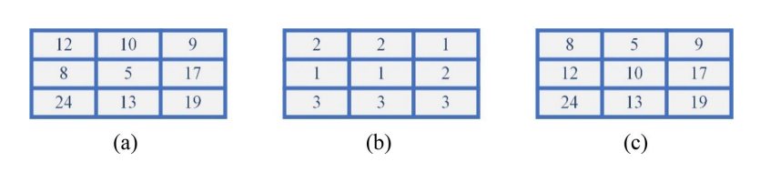
> 图5 按垂直方向排序一个 $y$ 数组，得到b sort_indices_y数组和c sorted_y数组

7. 接下来，使用sort_indices_y数组，对 $I_1$ 和 $x$ 执行位异或操作，得到 $I'_1$。此步骤如图6所示。
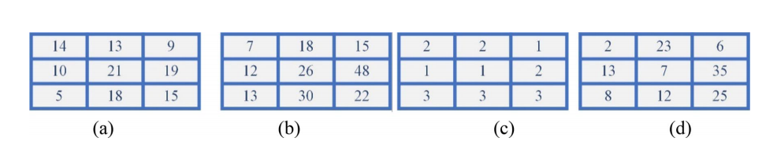
> 图6 对 **a** $I_1$ 和 **b** $x$ 使用**c** sort_indices_y 进行位异或操作，得到 **d** $I'_1$

8. 同样，使用sort_indices_x数组，对 $I_2$ 和 $y$ 执行位异或操作，得到$I'_2$。
9. $I'_1$ 和 $I'_2$ 被组合成 $I'$。
10. 现在，$I'$ 被分成两个水平的半部分—— $I_3$ 和$I_4$，每个大小$(M/2)×N$。
11. 同样，$x$ 和 $y$ 被重新定义为与 $I_3$ 和  $I_4$ 的维度相同的数组。
12. 对 $x$ 和 $y$ 数组进行排序操作，将索引排序保持在单独的数组中，如图7所示。同样，算法中将使用未排序的 $x$ 和 $y$ 数组，并进行排序操作以获得这两个数组的索引排序。
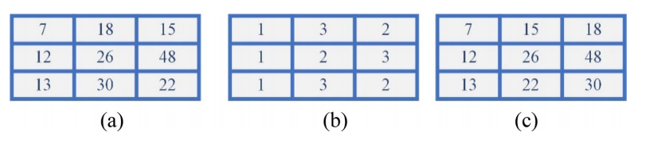
> 图7 在水平方向对 $x$ 数组进行排序，得到**b** sort_indices_x数组和**c** sorted_x数组

13. 现在，使用sort_indices_x，在 $I_3$ 和 $y$ 数组之间执行位异或来得到 $I'_3$ 。此步骤如图8所示。
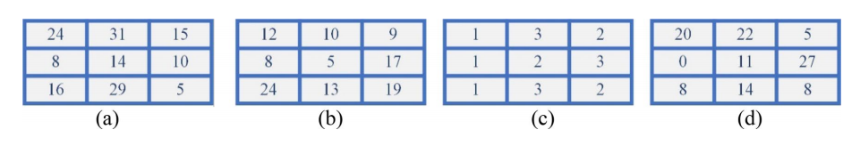
> 图8 使用 **c** sort_indices_x对 **a**$I_3$ 和**b** $y$ 进行位异或操作，得到**d** $I'_3$

14. 类似地，使用sort_indices_y，对 $I4$ 和 $x$ 数组位异或来得到 $I'_4$。
15. 然后，将 $I'_3$ 和 $I'_4$ 组合起来，得到融合后的加密图像($EI_D$)。然后，$EI_D$ 被带到了混乱阶段。

### 4.2 混淆过程

在此过程中，对融合($EI_D$)后的加密图像执行以下步骤。
1. 普通图像($I$)的所有强度级别都被添加到形式$S$中。
2. 接下来，$S$ 除以10的合适幂，使新形成的 $S<1$。
3. 在逻辑混沌映射的初始值上加入$S$，从而为每幅普通图像生成一个唯一的混沌序列。
4. 对上述写入步骤生成的混沌序列进行8次调制运算，得到来自范围[0,7]的混沌序列。
5. $EI_D$中的像素值被读取并以8位表示形式转换为二进制位。
6. 从混沌序列中读取一个值，并对二进制位表示执行循环右移。这是排列步骤，它不仅排列像素的二进制位，还改变像素值。图9显示了这个步骤的一个例子，当值为4时，将像素值为$(15)_{10}$转换为$(240)_{10}$。
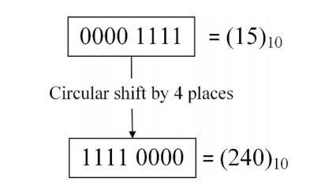
> 图9 循环右移四个位置，将像素强度从$(15)_{10}$改变到$(240)_{10}$

7. 在$EI_D$中重复所有像素强度的整个过程。
8. 然后，将所有二进制位表示转换为十进制强度，以接收最后加密的图像。

图10总结了混淆过程的整个过程。

> 图10 该方法的混淆过程

为了解密加密的图像，需要使用精确的密钥，并重复整个加密过程，但顺序相反。这意味着，首先会对加密的图像进行混淆过程。在混淆阶段，十进制值的强度被转换为8位的二进制位表示。使用相同的初始条件生成完全相同的混沌序列。对二进制位表示进行循环右移以得到$EI_D$。接下来，重复融合过程，执行反向步骤，得到与$I$完全相同的解密图像。

## 5 模拟结果
该算法在Matlab中实现，并在一个具有8GB RAM的i7处理器上运行。表1显示了普通的、加密的和解密的图像。从表中可以看出，加密的图像看起来是一个随机的图像，并没有显示任何东西。
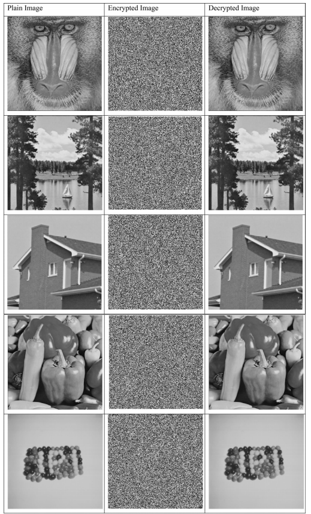
> 表1 普通的、加密的和解密的图像

### 5.1 密钥空间和密钥敏感度
由于提出的图像加密使用两个密钥生成Ikeda映射，一个密钥生成逻辑地图，每个密钥的精度高达$10^{-15}$小数位，需要$10^{45}(=10^{15}×10^{15}×10^{15})$次暴力攻击才能破坏系统。

接下来，可以通过使用稍微修改的密钥解密加密的图像来确保密钥灵敏度。如果解密过程无法解密加密的图像，则实现密钥的灵敏度（图11）。
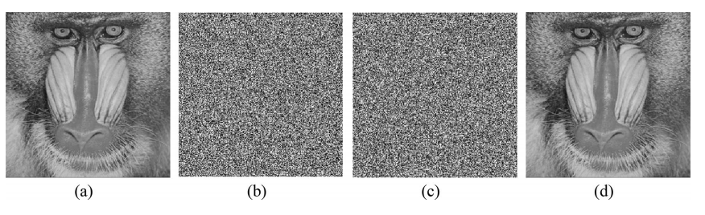
> 图11 一个普通图像a，加密图像b，使用错误密钥c和正确密钥d解密图像

### 5.2 统计分析
加密后的图像会受到统计分析器的攻击，以提取有关它的信息。提取有关加密图像的统计信息，以检查一个看似有噪声的图像是否携带了任何有意义的信息。这是通过获取加密图像的直方图和绘制像素之间的相关性来实现的。

#### 5.2.1 直方图分析
为一个真正的随机图像绘制的直方图将具有绝对均匀的直方图条[16]，因为所有像素强度的频率都是相等的。图12为理想的直方图，其中像素强度的高度完全相同。

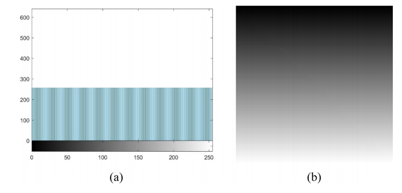
> 图12 真正随机图像(b)得到的均匀直方图(a)

狒狒平像和各自加密图像的直方图如图13所示。从图像中可以观察到狒狒加密图像直方图的均匀性。

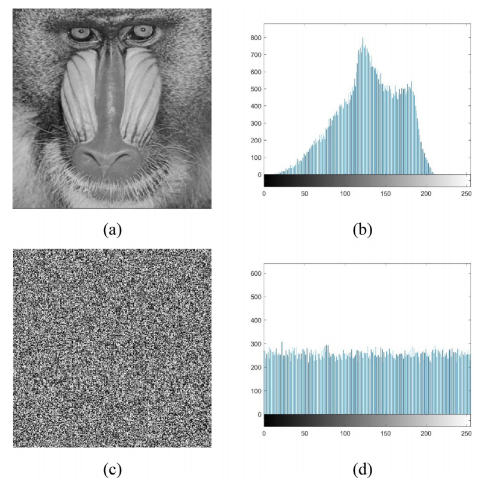
> 图13 (b)是纯图像(a)直方图；(d)是加密图像(c)的直方图

#### 5.2.2 相关分析
在普通图像中，相邻像素在垂直、水平和对角线的方向上存在相关性，使得相关性符合≈1。然而，加密算法应该能够破坏所有三个方向上像素之间的相关性。相关系数的计算是采用了[16]中提到的公式进行的。水平方向x和y上相邻像素之间的相关性计算如下：

$$
E(x)=\frac{1}{T}\sum^{T}_{i=1} x_i
$$

式中，E(x)为从图像中随机选取的像素总数的像素强度的平均值。在找到E(x)后，偏离平均值和协方差，用以下公式计算：

$$
D_x = \frac{1}{T}\sum^T_{i=1}(x_i - E(x))^2 \\
cov(x, y) = \frac{1}{T}\sum^T_{i=1}(x_i - E(x))(y_i - E(y))
$$

利用偏差和协方差值，相关系数计算如下：

$$
r_{xy} = \frac{cov(x, y)}{\sqrt{D_x}\sqrt{D_y}}
$$

对随机选择的3000个像素的普通图像和加密图像在水平、垂直和对角线方向上的像素之间的相关性进行协同计算，得到表2。

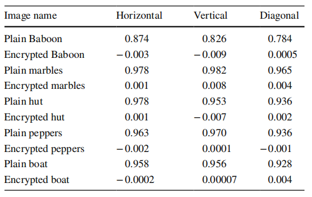
> 表2 相邻像素在水平、垂直和对角线方向上的相关性系数

从这个表中可以看出，相邻像素在水平垂直和对角方向上的相关性被破坏。因此，加密图像中的相关系数值显著下降(图14）。

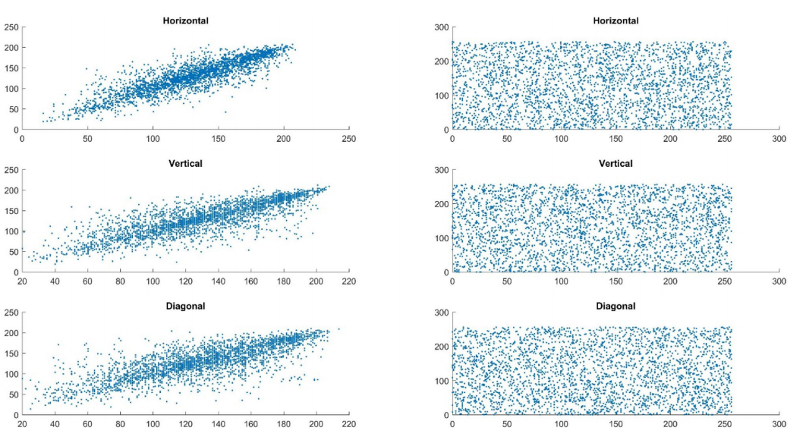
> 图14 狒狒平原（左）和加密图像（右）的相关图

从图像中可以看出，狒狒在水平、垂直和对角线方向上的像素是非常相关的。然而，在加密的图像中，像素强度彼此稀疏地分布。因此，所提出的加密算法完全破坏了纯图像的相关性。

与最近在图像加密领域的一些研究工作的比较如表3所示。可以观察到，从所提出的图像加密算法得到的加密图像能够以最好的方式降低像素之间的相关性。这是因为所提出的图像加密算法的混淆过程工作在位级。然而，正在进行比较的所有图像加密算法，不在位级执行任何操作。因此，可以推断在位级执行的操作对图像加密。

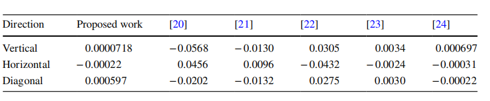
> 表3 与近期一些研究成果的相关性比较

### 5.3 圆周攻击分析
对攻击者进行微分攻击分析，建立了普通图像与加密图像之间的关系。为了确定加密算法抵御这种攻击的能力，我们确定了两个参数——像素数变化率(NPCR)和统一的平均变化强度(UACI)。对NPCR和UACI的评估是使用两个加密的图像来完成的。

在平图像中随机选择一个像素，并改变以形成新的平图像。然后，对普通图像和新的普通图像进行加密，接收两个加密图像$E_1$和$E_2$。采用以下公式和$E_1$和$E_2$，确定NPCR和UACI的值为[18]，具体见表4：

$$
D(i , j)=\left\{
\begin{aligned}
0 \quad if \quad E_1(i, j) = E_2(i, j) \\
1 \quad 其他情况 \\
\end{aligned}
\right. \\
$$

$$
NPCR = \frac{\sum_{i=1}^N \sum_{j=1}^M D(i, j)}{N * M} * 100 \\
$$

$$
UACI = \frac{\sum_{i=1}^N \sum_{j=1}^M \frac{E_1(i, j) - E_2(i, j)}{255}}{N * M}
$$

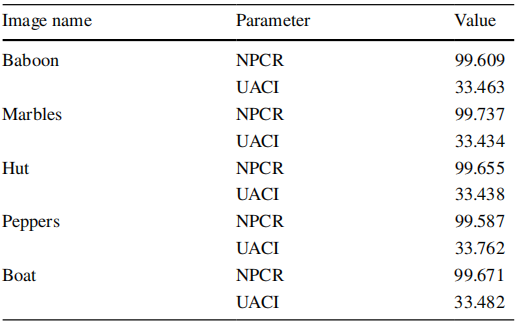
> 表4 各自普通图像的加密图像的NPCR和UACI值

### 5.4 信息熵分析

信息熵是系统中随机性的度量。系统的信息熵值越高，系统中的随机性或干扰值就越大。
图像的信息熵的计算公式[19]如下：

$$
H(m) = \sum_{i=0}^{2^n-1}p(m_i)\log_2\frac{1}{p(m_i)}
$$

其中$p(m_i)$是$m_i$在图像中出现的概率，$n$表示不同的灰色平面。由于一个灰度图像包含8个平面，因此使用上述公式的最大熵值为8。因此，接近8，图像的熵是，接近随机的。表5列出了普通图像和加密图像的信息熵值。从表中可以看出，由于加密算法，图像的信息熵增加了。

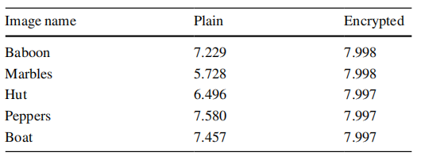
> 表5 普通图像和加密图像的信息熵

### 5.5 加密速度

速度是确定图像加密算法的效力的另一个参数。由于过程的速度高度依赖于实现它的硬件，因此不能进行点对点的比较。然而，我们采用了一些研究工作提出的加密时间(ms)，并与表6中所示的算法进行了比较。在Matlab中使用tic和toc命令测量了该算法的速度。

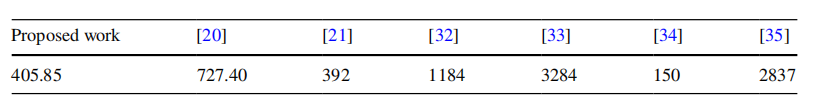
> 表6 加密速度比较（ms）

可以观察到，与其他研究工作相比，所提出的图像加密在加密普通图像时所花费的时间适当地更少。

## 6 结论
该图像加密算法利用像素级的Ikeda映射和位级的逻辑映射对给定的纯灰度图像进行加密。对普通图像的水平和垂直部分进行位异或运算，对混淆图像的所有像素强度进行逐位循环移位运算，获得加密的图像。对所提出的图像加密算法进行了仿真，并在周向、统计和蛮力攻击下对结果进行了评价。并与最近研究的灰度图像加密算法进行了比较。该工作的新颖之处在于加密算法的应用方式。只有两个混沌序列被用来产生这样的有希望的结果。阻塞和减半并不是什么新鲜事，然而，在作者有最好的了解之前，还没有进行过不平等的减半。引入越来越多的混沌序列增加了时间和空间的复杂性。因此，这种新颖的灰度算法是时间的需要，将吸引读者创造出更不复杂（时间和空间）的灰度图像加密算法。

## 参考文献
1. C. Li, Y. Zhang, E.Y. Xie, When an attacker meets a cipherimage in 2018: a year in review. J. Inf. Secur. Appl. 48, 102361 
(2019)
2. A. Girdhar, V. Kumar, Comprehensive survey of 3D image steganography techniques. IET Image Proc. 12(1), 1–10 (2018)
3. Y. Wang, K.-W. Wong, X. Liao, G. Chen, A new chaos-based fast 
image encryption algorithm. Appl. Soft Comput. 11(1), 514–522 
(2011)
4. K. Ikeda, Multiple-valued stationary state and its instability of the 
transmitted light by a ring cavity system. Opt. Commun. 30(2), 
257–261 (1979)
5. L. Liu, Q. Zhang, X. Wei, A RGB image encryption algorithm 
based on DNA encoding and chaos map. Comput. Electr. Eng. 
38(5), 1240–1248 (2012)
6. P.R. Sankpal, P.A. Vijaya, Image encryption using chaotic maps: 
a survey. 2014 Fifth international conference on signal and image 
processing (2014)
7. X. Jia, Image encryption using the Ikeda map. 2010 International 
conference on intelligent computing and cognitive informatics 
(2010)
8. Z.-L. Zhu, W. Zhang, K.-W. Wong, H. Yu, A chaos-based symmetric image encryption scheme using a bit-level permutation. 
Inf. Sci. 181(6), 1171–1186 (2011)
9. O. Mannai, R. Bechikh, H. Hermassi, R. Rhouma, S. Belghith, 
A new image encryption scheme based on a simple frst-order 
time-delay system with appropriate nonlinearity. Nonlinear Dyn. 
82(1–2), 107–117 (2015)
10. D.R. Alshibani, S.A. Qassir, Image enciphering based on DNA 
exclusive-OR operation union with chaotic maps. 2016 Al-Sadeq 
international conference on multidisciplinary in IT and communication science and applications (AIC-MITCSA) (2016)
11. M.M. Parvees, J.A. Samath, I.K. Raj, B.P. Bose, A colour byte 
scrambling technique for efcient image encryption based on 
combined chaotic map: image encryption using combined chaotic 
map. 2016 International conference on electrical, electronics, and 
optimization techniques (ICEEOT) (2016)
12. Y. Sekertekin, O. Atan, An image encryption algorithm using 
Ikeda and Henon chaotic maps. 2016 24th Telecommunications 
forum (TELFOR) (2016)
13. R. Becheikh, O. Mannai, R. Rhouma, S. Belghith, A novel family of strong S-Box based on Ikeda map and T-function. 2017 
IEEE/ACS 14th international conference on computer systems 
and applications (AICCSA) (2017)
14. N.A. Hikal, M.M. Eid, A new approach for palmprint image 
encryption based on hybrid chaotic maps. J. King Saud Univ. 
Comput. Inf. Sci. 32(7), 870–882 (2018)
15. C. Li, G. Luo, C. Li, A novel scheme for the preview of the image 
encryption based on chaotic Ikeda map. Int. J. Netw. Secur. 20(6), 
1105–1114 (2018)
16. A. Girdhar, V. Kumar, A RGB image encryption technique using 
Lorenz and Rossler chaotic system on DNA sequences. Multimed. 
Tools Appl. 77(20), 27017–27039 (2018)
17. A.C. Dăscălescu, R.E. Boriga, A novel fast chaos-based algorithm 
for generating random permutations with high shift factor suitable 
for image scrambling. Nonlinear Dyn. 74(1–2), 307–318 (2013)
18. Y. Wu, J.P. Noonan, S. Agaian, NPCR and UACI randomness tests 
for image encryption. Cyber J. Multidiscip. J. Sci. Technol. J. Sel. 
Areas Telecommun. 1(2), 31–38 (2011)
19. M.B. Farah, R. Guesmi, A. Kachouri, M. Samet, A novel chaos 
based optical image encryption using fractional Fourier transform 
and DNA sequence operation. Opt. Laser Technol. 121, 105777 
(2020)
20. S. Somaraj, M.A. Hussain, Performance and security analysis for 
image encryption using key image. Indian J. Sci. Technol. 8(35), 
1–4 (2015)
21. Y. Suryanto, M.T. Suryadi, K. Ramli, A secure and robust image 
encryption based on chaotic permutation multiple circular shrinking and expanding. J. Inf. Hiding Multimed. Signal Process. 7(4), 
697–713 (2016)
22. G.A. Sathish kumar, K.B. Bagan, N. Sriraam, Image encryption 
based on difusion and multiple chaotic maps. Int. J. Netw. Secur. 
Appl. 3(2), 181–194 (2011)
23. J.D.D. Nkapkop, J.Y. Efa, J.S.A.E. Fouda, M. Alidou, L. Bitjoka, 
M. Borda, A fast image encryption algorithm based on chaotic 
maps and the linear diophantine equation. Comput. Sci. Appl. 
1(4), 232–243 (2014)
24. S.F. Yousif, Grayscale image confusion and difusion based on 
multiple chaotic maps. 2018 1st International scientifc conference 
of engineering sciences - 3rd scientifc conference of engineering 
science (ISCES) (2018)
25. A. Girdhar, V. Kumar, A reversible and afne invariant 3D data 
hiding technique based on diference shifting and logistic map. J. 
Ambient Intell. Humaniz. Comput. 10(12), 4947–4961 (2019)
26. P. Refregier, B. Javidi, Optical image encryption based on input 
plane and Fourier plane random encoding. Opt. Lett. 20(7), 767–
769 (1995)
27. M.A. Mohamed, A.S. Samarah, M.I. Fath Allah, Optical encryption techniques: an overview. Int. J. Comput. Sci. Issues IJCSI 
11(2), 125–129 (2014)
28. A. Alfalou, C. Brosseau, Optical image compression and encryption methods. Adv. Opt. Photon. 1(3), 589–636 (2009)
29. G. Situ, J. Zhang, Multiple-image encryption by wavelength multiplexing. Opt. Lett. 30(11), 1306–1308 (2005)
