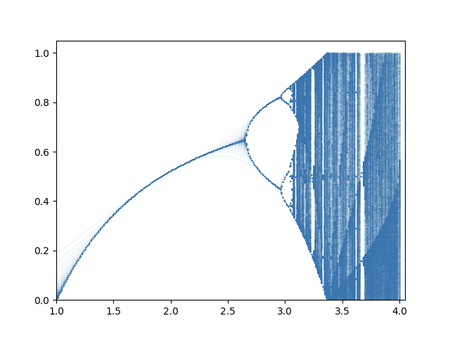

# demo

## 0. 引言
xxxxx

## 1. 提出混沌映射

### 1.1 经典的混沌映射

#### 1.1.1 Logistic 映射
Logistic 映射是一个二次多项式映射，经常作为典型范例来说明复杂的混沌现象是如何从非常简单的非线性动力学方程中产生的。它的数学表达式为：
$$x_{n+1} = \mu x_n(1-x_n), \mu \in [0,4], x_n \in (0, 1) \tag{1}$$
上式(1)中，$\mu$ 被称为分支参数。Logistic 映射的状态与 $\mu$ 的取值有关，当$3.5699456 < \mu \leq 4$ 时，系统处于混沌状态，且$\mu \approx 4$时，Logistic 映射分布最大。取$x_0 = 0.5$，分叉图如图1所示

      
图1 Logistic 映射分叉图

#### 1.1.2 Sine 映射

Sine 映射是一种以正弦函数为基础的混沌映射，它的数学表达式为：
$$x_{n+1} = \mu sin(\pi x_n), x_n \in [0, 1], \mu \in [0, 4] \tag{2}$$
上式(2)中，当 $\mu \in [3.48, 4]$ 时，系统处于混沌状态，且当 $\mu \approx 4$ 时，Sine 映射分布最大。取$x_0 = 0.5$，分叉图如图2所示

      
图2 Sine 映射分叉图

### 1.2 改进的混沌映射
考虑到经典的 Logistic 映射和 Sine 映射都存在分布不均匀，分支参数范围小等缺陷，本文结合这两种经典的一位混沌映射提出一种新的混沌系统——(todo: fill it)，其表达式为：
$$x_{n+1} = (t * arcsin(4 * x * (1-x))) \quad mod \quad 1, \tag{3}  x_n \in (0, 1), t \in [1, +\infty) $$
上式(3)中，$t$ 为分支参数，且 t 越大，系统混沌性表现的越明显。取$x_0 = 0.5$，当 $t=1 / t=7 / t=26$时的分支图如图3所示：

      
(a) t=1时分支图

    

      
(b) t=7时分支图

      
(c) t=26时分支图

 
图3 xxx映射分叉图

### 1.3 性能测试

#### 1.3.1 初值敏感性
初值敏感性是衡量混沌系统的一个重要属性，即系统的初始值发生细微的变化，其输出结果会产生巨大的差异。李雅普诺夫指数(Lyaponuv exponents)常常被用来判定一个系统的混沌性，通过图像可以直观地看出某个系统或者映射是否是混沌系统或映射。
Lyaponuv 指数表示相空间相邻轨迹的平均指数发散率的数值特征。又称李雅普诺夫特征指数，是用于识别混沌运动若干数值的特征之一。
LE指数不同的取值有不同的含义：
1. 当 $LE > 0$ 时，系统进入混沌状态，存在混沌行为，对应的映射叫做混沌映射，且其混沌性强弱与LE指数的大小有关。
2. 当 $LE = 0$ 时，系统处于稳定状态。
3. 当 $LE < 0$ 时，系统的运动状态会趋于稳定且此时初值不敏感。

图4(a) 为 Sine 映射的 LE 指数图，当$\mu > 3.464$ 时，$LE > 0$；图4(b) 为 Logistic 映射的 LE 指数图，当$\mu > 3.57$ 时， $LE > 0$；图4(c) 为xxx映射的 LE 指数图，当 $\mu > 1$ 时，

      
(a) Sine 映射 LE 指数图

      
(b) Logistic 映射 LE 指数图

      
(c) t=26时分支图

 
图4 LE 指数对比

## 2. 加密算法设计

### 2.1 密钥生成
设 $K$ 表示密钥，$K = 	\left\{ x_0, t_0, r_0, x_1, t_1, r_1, x_2, t_2, r_2 \right\}$，其中 $x, t, r$ 分别为混沌映射初始值、控制参数、迭代起步点。

$\left\{ x_i, t_i, r_i\right\}$ 分别作为xxx映射系统，即表达式(3)的初始值以及其控制参数，迭代 $r_i + M \times N$次，为了避免暂态效应，舍去前 $r_i$ 项，得到长度为 $M \times N$ 的矩阵，记作$\left\{ x_i\right\}$，$i=1,2,3$。将 $x_0$ 记作排序矩阵 $sort\_list$，$x_1$ 记作异或矩阵 $xor\_list$，$x_2$ 记作扩散矩阵 $spread\_list$。
$$
sort\_list = xxx(x_0, t_0, r_0 + M \times N) - xxx(x_0, t_0, r_0) \tag{4} \\
$$
 

$$
xor\_list = xxx(x_1, t_1, r_1 + M \times N) - xxx(x_1, t_1, r_1) \tag{5} \\
$$
 

$$
spread\_list = xxx(x_2, t_2, r_2 + M \times N) - xxx(x_2, t_2, r_2) \tag{6}
$$

### 2.2 加密过程
将明文图像用矩阵 $P$ 表示，其大小为 $M \times N$，利用生成的 $sort\_list, xor\_list, spread\_list$ 对原始的明文矩阵进行加密。
加密过程分为两部分——置乱和扩散。
在置乱环节，首先对 明文图像 $P$使用 $sort\_list$ 进行排序置乱，将排序置乱后的矩阵 $sorted\_list$ 与 $xor\_list$ 进行异或置乱，得到置乱完毕的矩阵 $xored\_list$。
在扩散环节，对 $xored\_list$ 使用 $spread\_list$ 进行扩散，输出最终的矩阵 $encrypted\_list$，并将矩阵作为图像输出。

具体流程图如 图5 所示

  
图5 加密流程图

#### 2.2.1 置乱过程

**Step 1:** 将 $sort\_list$ 按照先行后列的顺序，变换大小为 $M \times N$ 的矩阵$new\_sort\_list$。
**Step 2：** 计算 $new\_sort\_list$ 每一行的和 $\left\{ row\_sum_i\right\}(i=1,2...N)$，根据$\left\{ row\_sum_i \right\}$对行索引进行降序排序，得到一个长度 $N$ 的矩阵 $\left\{ row_i\right\}(i=1,2...N)$。根据每一行的前后位置变化，对原始图像 $P$ 进行重组，得到 $row\_sorted\_list$。
**Step 3:** 计算 $new\_sort\_list$ 每一列的和 $\left\{ col\_sum_i \right\}(i=1,2...M)$，根据$\left\{ col\_sum_i \right\}$对列索引进行降序排序，得到一个长度 $M$ 的矩阵 $\left\{col_i \right\}(i=1,2....M)$。$\left\{col_i \right\}$ 对经过 Step 1 排序后的矩阵$row\_sorted\_list$再一次重组，得到最终排序完毕的矩阵 $sorted\_list$。

置换图如图6所示，根据$new\_sort\_list$对原始图像 $P$ 矩阵的对应关系进行置换形成置换后的二维矩阵 $sorted\_list$

  
图6 排序置乱过程

**Step4:** 将得到的 $sorted\_list$ 和 $xor\_list$ 进行异或，得到置乱完毕的矩阵 $xored\_list$

#### 2.2.2 扩散过程

